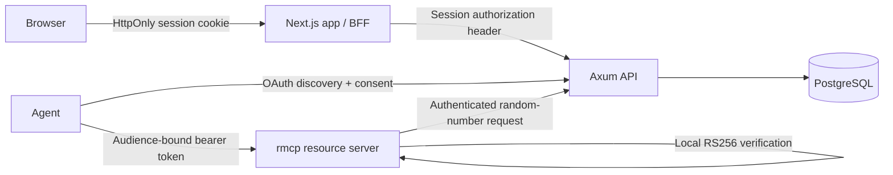

## Responsibilities

| Component | Owns |
| --- | --- |
| `apps/app` | Forms, consent UI, and the opaque session cookie |
| `services/api` | Users, sessions, tenancy, upstream OIDC, OAuth/OIDC issuance, and audit records |
| `services/mcp` | MCP transport, resource discovery, bearer challenges, and tool authorization |
| `crates/auth` | Password/token primitives, PKCE, JWT/JWK, and OAuth validation |
| `crates/db` | PostgreSQL connection and embedded migrations |
| `crates/mcp` | Reusable MCP authorization and security metadata helpers |

MCP discovery validates tokens locally; each random-number tool call also reaches the API. It validates the JWT signature, issuer, audience, expiry, and scope locally. The access token carries the user, workspace, project, role, client, and scope chosen during consent.

## Tenant invariant

Every application session has one active workspace and project. Every OAuth grant is bound to one project and one RFC 8707 resource. A tool therefore receives an explicit project context instead of relying on ambient global state.
